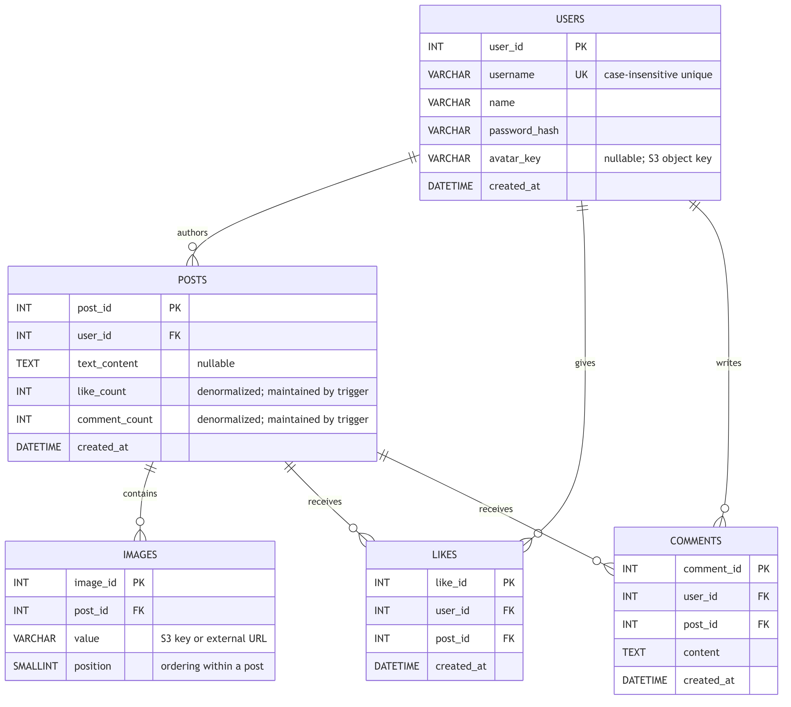
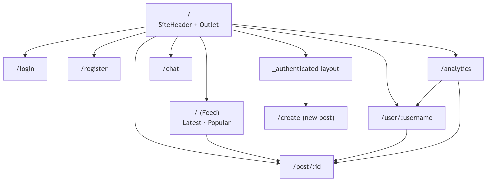
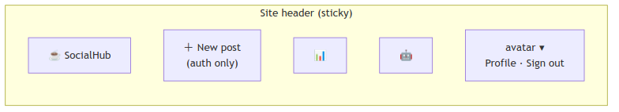
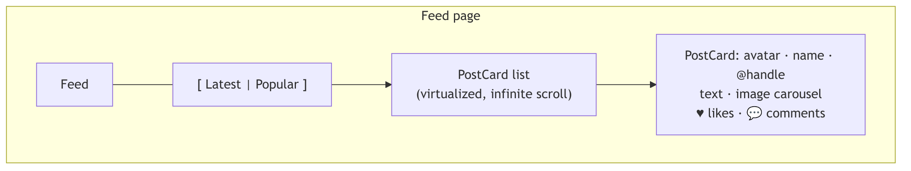
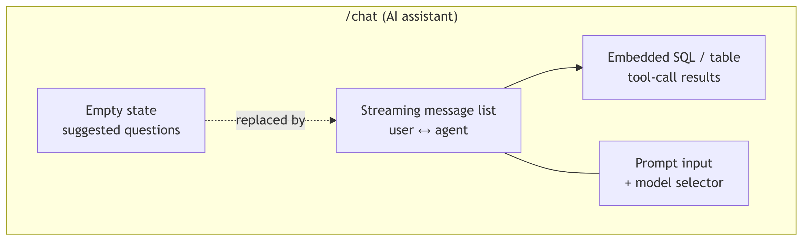
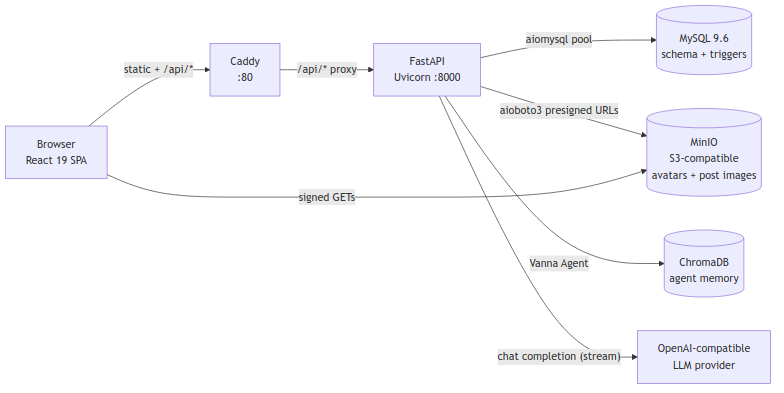
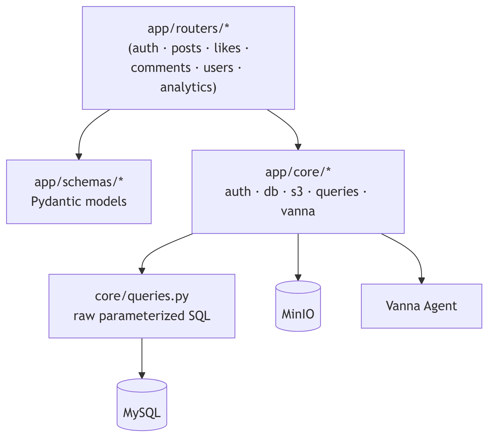
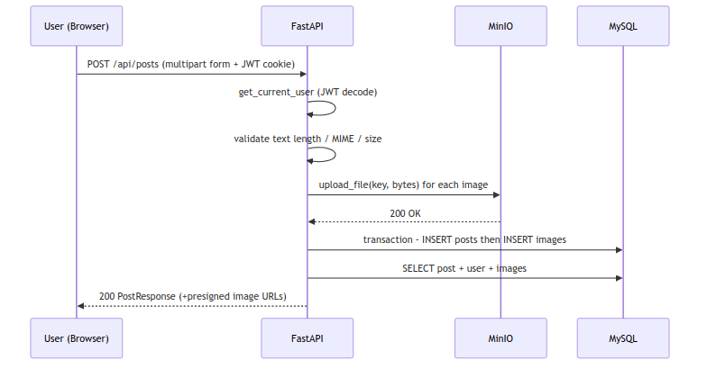
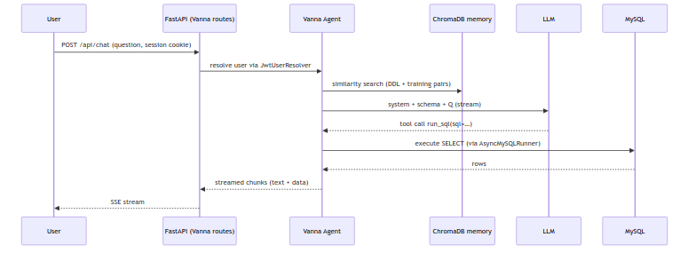

# COMP3278 Group Project — SocialHub

A lightweight social-media web application built around a MySQL relational database.
Users can register, post text and images, like/unlike posts, comment, browse profiles,
view platform-wide analytics, and query the database in natural language through an
AI chat assistant that translates questions into SQL.

---

## 1. User Requirements

### 1.1 Target Users
Two informal personas were considered throughout development:

| Persona              | Primary needs                                                                          |
| -------------------- | -------------------------------------------------------------------------------------- |
| **End user**         | Create an account, share text/photo posts, react and comment, discover popular posts.  |
| **Platform analyst** | Inspect activity trends, identify top posts/users, and run ad-hoc SQL-style questions. |

### 1.2 Functional Requirements

| ID   | Requirement                                                                                   |
| ---- | --------------------------------------------------------------------------------------------- |
| F-1  | Visitors may register with a unique username, display name, and password.                     |
| F-2  | Registered users authenticate via username/password; sessions are JWT cookies.                |
| F-3  | A user may upload / replace a profile avatar (WebP/JPEG/PNG, ≤ size limit).                   |
| F-4  | A user may create a post with text (≤ 2000 chars), uploaded image blobs, and/or image URLs.   |
| F-5  | Every user can browse the global feed sorted by **Latest** or **Popular** (paginated).        |
| F-6  | A user can view any other user's profile, showing their posts and aggregate stats.            |
| F-7  | A signed-in user may like/unlike a post; each (user, post) pair is unique.                    |
| F-8  | Any user may read comments on a post; signed-in users may post comments.                      |
| F-9  | A post author may delete their own post (cascades to images, likes, comments).                |
| F-10 | Anyone may access `/analytics` showing top 10 posts, top 10 users, and 30-day activity.       |
| F-11 | A signed-in user may chat with an AI agent that answers questions by running SQL on the DB.   |

### 1.3 Non-Functional Requirements

- **Consistency** — denormalized counters (`like_count`, `comment_count`) kept in sync by DB triggers, not application code.
- **Statelessness** — API is stateless; all session state lives in a signed JWT cookie.
- **Scalability** — feeds use keyset (cursor) pagination over indexed columns.
- **Separation of concerns** — React SPA ↔ FastAPI ↔ MySQL/MinIO; containerized, reproducible deployment.
- **Security** — bcrypt password hashing, HttpOnly session cookie, ownership checks on mutating routes, MIME/size validation on uploads.

---

## 2. ER Modeling and Design

### 2.1 Entity-Relationship Diagram



*Source: [`assets/er-diagram.mmd`](assets/er-diagram.mmd)*

### 2.2 Design Rationale

- **Unique `(user_id, post_id)` on `likes`** — enforces idempotent "like" semantics at the DB level.
- **Functional index `LOWER(username)`** — lets users log in case-insensitively while still storing the original casing.
- **Denormalized counters on `posts`** — `like_count` and `comment_count` avoid expensive `COUNT(*)` during feed queries; consistency is guaranteed by four triggers (`after_like_insert/delete`, `after_comment_insert/delete`).
- **`ON DELETE CASCADE`** — deleting a user or post automatically removes dependent rows; avoids application-level fan-out.
- **Composite keyset indexes** — `(created_at DESC, post_id)` and `(like_count DESC, post_id)` support stable, O(log n) cursor pagination even when values tie.
- **`images.value`** — single column storing either an internal `s3://…` reference or an external URL, keeping the schema flat while supporting both upload paths.

### 2.3 Normalization Notes
All tables are in **3NF**. The only non-key derived data (`like_count`, `comment_count`) is a deliberate denormalization: the cost (four tiny triggers) is tiny compared with the benefit (O(1) reads on the hot feed path).

---

## 3. SQL Queries

All SQL below is executed through `aiomysql` in `app/core/queries.py`. Placeholders (`%s`) are parameterized — no string interpolation of user input.

### 3.1 Schema (excerpt)

```sql
CREATE TABLE users (
    user_id       INT PRIMARY KEY AUTO_INCREMENT,
    username      VARCHAR(39)  NOT NULL,
    name          VARCHAR(50)  NOT NULL,
    password_hash VARCHAR(255) NOT NULL,
    avatar_key    VARCHAR(255) DEFAULT NULL,
    created_at    DATETIME     NOT NULL DEFAULT NOW(),
    UNIQUE KEY users_username_lower ((LOWER(username)))
);

CREATE TABLE posts (
    post_id       INT PRIMARY KEY AUTO_INCREMENT,
    user_id       INT      NOT NULL,
    text_content  TEXT,
    like_count    INT      NOT NULL DEFAULT 0,
    comment_count INT      NOT NULL DEFAULT 0,
    created_at    DATETIME NOT NULL DEFAULT NOW(),
    FOREIGN KEY (user_id) REFERENCES users(user_id) ON DELETE CASCADE
);

CREATE TRIGGER after_like_insert AFTER INSERT ON likes FOR EACH ROW
    UPDATE posts SET like_count = like_count + 1 WHERE post_id = NEW.post_id;
```

(See `schema.sql` for the complete DDL including `images`, `likes`, `comments`, the four triggers and all indexes.)

### 3.2 Authentication

```sql
-- Register: uniqueness check uses the LOWER(username) functional index
SELECT * FROM users WHERE LOWER(username) = LOWER(%s);

-- Register: insert
INSERT INTO users (username, name, password_hash) VALUES (%s, %s, %s);
```

### 3.3 Feed — Latest (keyset pagination)

```sql
SELECT p.*, u.username, u.name, u.avatar_key
FROM posts p JOIN users u ON p.user_id = u.user_id
WHERE (p.created_at, p.post_id) < (%s, %s)
ORDER BY p.created_at DESC, p.post_id DESC
LIMIT %s;
```

### 3.4 Feed — Popular

```sql
SELECT p.*, u.username, u.name, u.avatar_key
FROM posts p JOIN users u ON p.user_id = u.user_id
WHERE (p.like_count, p.post_id) < (%s, %s)
ORDER BY p.like_count DESC, p.post_id DESC
LIMIT %s;
```

### 3.5 Batch Hydration of a Feed Page

Two batched queries avoid the N+1 problem when rendering a page of posts:

```sql
-- Images for all posts on the current page
SELECT * FROM images
WHERE post_id IN (%s, %s, …)
ORDER BY post_id ASC, position ASC;

-- Which of these posts has the current user already liked?
SELECT post_id FROM likes
WHERE user_id = %s AND post_id IN (%s, %s, …);
```

### 3.6 Profile Summary (aggregate)

```sql
SELECT u.user_id, u.username, u.name, u.avatar_key, u.created_at,
       COUNT(DISTINCT p.post_id)       AS post_count,
       COALESCE(SUM(p.like_count), 0)  AS total_likes
FROM users u LEFT JOIN posts p ON p.user_id = u.user_id
WHERE LOWER(u.username) = LOWER(%s)
GROUP BY u.user_id, u.username, u.name, u.avatar_key, u.created_at;
```

### 3.7 Analytics Queries

```sql
-- Top 10 most liked posts
SELECT p.post_id, u.username, p.text_content, p.like_count
FROM posts p JOIN users u ON p.user_id = u.user_id
ORDER BY p.like_count DESC LIMIT 10;

-- Top 10 most active users (+ likes received)
SELECT u.username, u.name,
       COUNT(DISTINCT p.post_id)      AS post_count,
       COALESCE(SUM(p.like_count), 0) AS total_likes
FROM users u LEFT JOIN posts p ON p.user_id = u.user_id
GROUP BY u.user_id, u.username, u.name
ORDER BY post_count DESC LIMIT 10;

-- Posts / likes per day (last 30 days)
SELECT DATE(created_at) AS date, COUNT(*) AS count
FROM posts   WHERE created_at >= NOW() - INTERVAL 30 DAY
GROUP BY DATE(created_at) ORDER BY date ASC;

SELECT DATE(created_at) AS date, COUNT(*) AS count
FROM likes   WHERE created_at >= NOW() - INTERVAL 30 DAY
GROUP BY DATE(created_at) ORDER BY date ASC;
```

### 3.8 Maintenance — Recompute Counts

If triggers are ever bypassed (e.g., bulk-loading seed data), a single `UPDATE … JOIN` statement resynchronises `posts`:

```sql
UPDATE posts p
LEFT JOIN (SELECT post_id, COUNT(*) AS cnt FROM likes    GROUP BY post_id) lk ON lk.post_id = p.post_id
LEFT JOIN (SELECT post_id, COUNT(*) AS cnt FROM comments GROUP BY post_id) cm ON cm.post_id = p.post_id
SET p.like_count    = COALESCE(lk.cnt, 0),
    p.comment_count = COALESCE(cm.cnt, 0);
```

---

## 4. UI Design

### 4.1 Visual Language
The front-end uses a **retro "8-bit" design system** — shadcn/ui primitives re-skinned with pixel fonts, hard-edged borders, and a chunky palette. Icons come from `pixelarticons`. Typography is toggleable (pixel ↔ sans) via a header button; dark mode is supported.

### 4.2 Information Architecture



*Source: [`assets/information-architecture.mmd`](assets/information-architecture.mmd)*

### 4.3 Page-Level Sketches

**Site header**



*Source: [`assets/ui-site-header.mmd`](assets/ui-site-header.mmd)*

**Feed page**



*Source: [`assets/ui-feed.mmd`](assets/ui-feed.mmd)*

**User profile**


*Source: [`assets/ui-profile.mmd`](assets/ui-profile.mmd)*

**Analytics**


*Source: [`assets/ui-analytics.mmd`](assets/ui-analytics.mmd)*

**Chat**



*Source: [`assets/ui-chat.mmd`](assets/ui-chat.mmd)*

### 4.4 UX Highlights

- **Optimistic likes** — the heart toggles immediately; TanStack Query rolls back on failure.
- **Infinite scroll** — cursors returned by the API drive `useInfiniteQuery`; a virtualizer keeps the DOM small.
- **Post composition** — supports drag-and-drop blob uploads *and* external URLs in one form; server validates MIME type and size.
- **Auth-aware header** — shows Sign in / Sign up for guests, and avatar menu for signed-in users.
- **Resilient errors** — root `errorComponent` renders a friendly page and a "back to home" button.
- **Toasts** — `sonner` provides non-blocking success/error feedback for mutations.

---

## 5. System Architecture



*Source: [`assets/system-architecture.mmd`](assets/system-architecture.mmd)*

### 5.1 Backend Layer Map



*Source: [`assets/backend-layers.mmd`](assets/backend-layers.mmd)*

### 5.2 Request Flow — "Create Post"



*Source: [`assets/sequence-create-post.mmd`](assets/sequence-create-post.mmd)*

### 5.3 AI Chat Flow — "Natural-language → SQL"



*Source: [`assets/sequence-ai-chat.mmd`](assets/sequence-ai-chat.mmd)*

The agent is seeded at startup (`seed_memory()`) with the schema DDL and 16 curated
`(question, SQL)` training pairs (see `app/core/vanna_config.py`) so that common
analytics questions resolve directly from memory.

> A full design document for this subsystem — grounding, request lifecycle, safety,
> per-request model selection, streaming protocol — lives in
> [`TEXT_TO_SQL.md`](TEXT_TO_SQL.md).

---

## 6. Technology Stack

The table below is a map; each library is described in depth in §6.1–§6.5 with the
exact role it plays in SocialHub.

| Layer              | Choice                                                                                 |
| ------------------ | -------------------------------------------------------------------------------------- |
| **Frontend core**  | React 19, TypeScript 5, Vite, Bun                                                      |
| **Frontend state** | TanStack Router, TanStack Query, TanStack Virtual                                      |
| **Frontend UI**    | Tailwind CSS v4, shadcn/ui (8-bit theme), Radix UI, pixelarticons, Recharts, Sonner, Streamdown, Motion, Embla Carousel |
| **API client**     | openapi-fetch + openapi-typescript                                                     |
| **Backend core**   | Python 3.14, FastAPI, Uvicorn, Pydantic v2, structlog                                  |
| **DB driver**      | `aiomysql` — raw, parameterized SQL (no ORM)                                           |
| **Object store**   | MinIO (S3-compatible) accessed via `aioboto3` with presigned URLs                      |
| **Auth**           | `bcrypt` (hashing) + `PyJWT` in an HttpOnly cookie                                     |
| **AI / text-to-SQL** | Vanna Agent, ChromaDB, AsyncOpenAI, pandas                                           |
| **Database**       | MySQL 9.6 (schema + triggers in `schema.sql`)                                          |
| **Reverse proxy**  | Caddy (serves SPA + proxies `/api/*` in the deploy profile)                            |
| **DevX**           | `uv`, Ruff, Bun (+ `bun test`), Oxlint/Oxfmt, pytest, Docker Compose                   |

### 6.1 Backend Libraries

- **FastAPI (≥ 0.135)** — Async web framework built on Starlette. Declarative routing
  (`@router.post(...)`), dependency injection via `Depends()`, automatic OpenAPI/Swagger
  generation, and typed request/response models. Used everywhere in `app/routers/*`; each
  endpoint is an async function that receives Pydantic-parsed bodies and auth principals.
- **Uvicorn (with `[standard]` extras)** — ASGI server that runs the FastAPI app.
  `--reload` is used in development; in Docker we run it directly under `entrypoint.sh`.
- **Pydantic v2 + `pydantic-settings`** — Data-validation layer. All request bodies and
  response models in `app/schemas/*` are Pydantic models — invalid input is rejected at the
  edge with a 422 before any business code runs. `pydantic-settings` loads `.env` values
  into a typed `Settings` object (`app/core/config.py`).
- **aiomysql (≥ 0.3)** — Truly-async MySQL client. We intentionally avoid an ORM: every
  SQL statement lives in `app/core/queries.py`, parameterized with `%s`. A single
  `aiomysql.Pool` is initialised in the FastAPI `lifespan` and checked out per request
  via `db.get_conn()` / `db.transaction()` context managers.
- **aioboto3 (≥ 15.5)** — Async port of `boto3`. Used by `app/core/s3.py` to upload
  avatars / post images to MinIO and to mint presigned `GET` URLs the browser hits
  directly — the FastAPI process never streams image bytes in responses.
- **PyJWT (≥ 2.12)** — HS256 signed session tokens. Tokens are set as an HttpOnly cookie
  on login/register, decoded in the `get_current_user` dependency, and also parsed inside
  the Vanna `JwtUserResolver` to reuse the same identity for the AI chat.
- **bcrypt (≥ 5.0)** — Password hashing with per-hash salt and a tunable work factor.
  `auth.hash_password` / `auth.verify_password` are the only surfaces that touch plaintext
  passwords, and plaintext never leaves request memory.
- **python-multipart (≥ 0.0.22)** — Enables FastAPI to parse `multipart/form-data` bodies.
  Used by the post-create and avatar-upload endpoints to accept files alongside JSON-ish
  form fields.
- **cryptography (≥ 43)** — A transitive-but-explicit dependency pulled in for MySQL's
  `caching_sha2_password` auth plugin — without it connecting to MySQL 9 fails.
- **structlog (≥ 25.5)** — Structured, key-value logging. Configured in `main.py` with
  `contextvars.merge_contextvars`, ISO timestamps, and a colorised console renderer; every
  route logs events like `log.info("post_deleted", post_id=..., user_id=...)`.
- **Vanna (`vanna[openai]` ≥ 2.0)** — The agent framework that drives the `/chat` page.
  Supplies the agent loop, tool registry, OpenAI integration, ChromaDB memory adapter,
  SSE chat routes, and rich UI component protocol. We subclass a few of its building
  blocks (`OpenAILlmService`, `RunSqlTool`, `ChatHandler`, `UserResolver`) rather than
  reinventing them — see [`TEXT_TO_SQL.md`](TEXT_TO_SQL.md).
- **ChromaDB (≥ 1.5)** — Embedded persistent vector store used for the Vanna agent's
  memory: the schema DDL plus curated question/SQL pairs are upserted as documents
  and retrieved by similarity at chat time. Persists under `.chroma/`.
- **pandas** — `AsyncMySQLRunner.run_sql` returns a `pandas.DataFrame` because that's
  what Vanna's `SqlRunner` contract requires; the DataFrame is serialised to
  `{columns, rows}` before streaming to the browser.
- **openai (AsyncOpenAI client)** — Official OpenAI SDK, configured with a custom
  `base_url` so any OpenAI-compatible endpoint works. We use the **async** client
  (`AsyncOpenAI`) exclusively — the stock Vanna integration uses the sync client,
  which would block Uvicorn's event loop on every chat call.

### 6.2 Backend Dev / Quality Tools

- **uv** — Fast Rust-based Python package & project manager. `pyproject.toml` declares
  dependency groups (`dev`); `uv sync --all-groups` installs both runtime and dev
  dependencies into a project-local `.venv`. `uv run ...` is used instead of `python -m`.
- **Ruff (≥ 0.15)** — All-in-one Python linter/formatter written in Rust. `ruff.toml`
  picks rule families `E/F/I/UP/B/SIM/ASYNC` (errors, imports, modernization, bugbear,
  simplifications, async pitfalls) with a 100-char line limit and Python 3.14 target.
- **pytest + pytest-asyncio + httpx + faker + tqdm** — Backend test stack. `asyncio_mode
  = "auto"` lets every coroutine test run without per-function decorators; `httpx` powers
  FastAPI's `TestClient` equivalent; `faker` generates the demo dataset in `scripts/seed.py`.

### 6.3 Frontend Libraries

- **React 19** — UI library. Used with the new Suspense-friendly data-fetching patterns;
  the whole app is an SPA mounted in `main.tsx`.
- **TanStack Router (≥ 1.168)** — Typed, file-based router (`src/routes/*.tsx`). The
  generated `routeTree.gen.ts` gives compile-time URL / param safety. We use a nested
  `_authenticated` layout route as an auth gate, `$id` / `$username` dynamic segments,
  and a `validateSearch` schema for `/chat?q=...` deep-links.
- **TanStack Query (≥ 5.96)** — Server-state cache for all `/api/*` reads and mutations.
  We use `useInfiniteQuery` for feed / comment pagination, `useMutation` with optimistic
  updates for likes, and `invalidateQueries` after mutations to keep feeds fresh.
- **TanStack Virtual** — Row virtualization for the feed: only the posts currently in the
  viewport are kept in the DOM, so scrolling large feeds stays smooth.
- **openapi-fetch + openapi-typescript** — Our typed API client. `bun run generate` hits
  the running backend's `/openapi.json` and regenerates `src/lib/api/schema.d.ts`. Code
  calls e.g. `client.GET("/api/posts", { params: { query: { sort } } })` and the types
  for every endpoint (params, body, responses) come from the server, eliminating drift.
- **Tailwind CSS v4** — Utility-first CSS; configured through the `@tailwindcss/vite`
  plugin (no `tailwind.config.js` — v4 uses a CSS-first config in `index.css`).
- **shadcn/ui (8-bit theme)** — A set of component *source files* copied into
  `src/components/ui` rather than a classic node_modules library. We use the retro "8-bit"
  preset, which restyles Radix primitives with pixel fonts and hard borders.
- **Radix UI** — Unstyled, accessible primitives (dropdown, tabs, dialog, avatar,
  separator, …) that shadcn wraps. Provides keyboard navigation and focus management
  out of the box.
- **pixelarticons** — Single-stroke pixel-art icon set; imported as React components
  (`import { Heart, Fire } from "pixelarticons/react"`). Fits the 8-bit visual theme.
- **Recharts (3.8)** — Composable chart primitives (`AreaChart`, `CartesianGrid`, …).
  Powers every chart on `/analytics`; wrapped in shadcn's `ChartContainer` so styles
  flow from CSS variables.
- **Sonner** — Minimal toast library. Mounted once in `__root.tsx`; mutations call
  `toast.success(...)` / `toast.error(...)` for non-blocking feedback.
- **Streamdown** — Markdown renderer tuned for *streaming* tokens — can render partial
  / unterminated Markdown safely. Used to render the assistant's streamed replies in
  `/chat` without flicker.
- **Motion (framer-motion successor)** — Animations, used sparingly for micro-interactions
  (e.g. the chat scroll-to-bottom pill).
- **Embla Carousel** — Lightweight carousel used inside `PostCard` when a post has more
  than one image.
- **date-fns (v4)** — Functional date library; `formatDistanceToNow(parseApiDate(...))`
  is how all "2 minutes ago" labels are rendered.
- **nanoid** — Short unique id generator; used for client-side ids on chat messages.
- **ai** (Vercel AI SDK) — Types and helpers for chat UIs; we reuse its message-shape
  primitives rather than invent our own.
- **class-variance-authority + tailwind-merge + clsx** — Conventional shadcn utilities
  for composing variant-aware class strings without conflicts.

### 6.4 Frontend Dev / Quality Tools

- **Bun** — JavaScript runtime + package manager + test runner. Replaces npm/yarn/pnpm;
  `bun install`, `bun dev`, `bun test`, `bun run generate` are the daily commands.
- **Vite 8** — Dev server (HMR in ~10 ms) and production bundler. Proxies `/api` to the
  FastAPI backend during development via `vite.config.ts`.
- **oxlint / oxfmt** — Rust-based alternatives to ESLint/Prettier that are an
  order-of-magnitude faster. Configured as `bun lint` / `bun fmt`.
- **knip** — Dead-code / unused-export detector; configured via `knip.json`.
- **openapi-typescript (≥ 7.13)** — Generator that produces `schema.d.ts` from the
  backend's OpenAPI document (invoked by `bun run generate`).

### 6.5 Infrastructure & Tooling

- **MySQL 9.6** — Primary datastore. `schema.sql` is mounted into
  `/docker-entrypoint-initdb.d/` so a fresh container applies the schema + triggers on
  first boot. Functional index `LOWER(username)` requires MySQL 8+.
- **MinIO** — S3-compatible object store. In local development it replaces AWS S3
  byte-for-byte; in production the same `aioboto3` code can point at real S3.
- **Caddy** — Reverse proxy used in the deploy profile. `Caddyfile` serves the compiled
  SPA statically and proxies `/api/*` to the `api` service. Automatic SPA fallback to
  `index.html` for client-side routes.
- **Docker Compose** — Orchestrates MySQL + MinIO for local dev, plus the `api` and `web`
  services under the `deploy` profile for a one-command full-stack deployment.

---

## 7. Repository Layout

```
comp3278-social-hub/
├── schema.sql                 # DDL + triggers
├── docker-compose.yml         # MySQL, MinIO, API, Caddy (web)
├── Caddyfile                  # SPA fallback + /api proxy
├── pyproject.toml             # Python deps (uv)
├── app/
│   ├── main.py                # FastAPI app + lifespan
│   ├── routers/               # auth, posts, likes, comments, users, analytics, website_config
│   ├── schemas/               # Pydantic request/response models
│   ├── core/
│   │   ├── db.py              # aiomysql pool + transaction ctx
│   │   ├── queries.py         # every SQL statement
│   │   ├── s3.py              # MinIO upload / presign
│   │   ├── auth.py            # bcrypt + JWT
│   │   ├── vanna.py           # AI agent init + memory seeding
│   │   └── vanna_config.py    # DDL + Q/A training pairs
│   └── exceptions.py
├── scripts/seed.py            # Faker-based demo data
├── web/                       # React SPA (Bun)
│   └── src/{routes,components,features/chat,lib}
├── docker/{Dockerfile.api, Dockerfile.web}
└── tests/
```

---

## 8. Running the Project

```bash
# 1. Infrastructure
docker compose up -d           # MySQL + MinIO (schema auto-applied)

# 2. Backend
uv sync --all-groups
uv run python scripts/seed.py      # optional: Faker-generated demo data
uv run uvicorn app.main:app --reload --host 0.0.0.0 --port 8000

# 3. Frontend
cd web && bun install && bun dev   # http://localhost:5173

# 4. Full containerized deploy
docker compose --profile deploy up --build -d   # http://localhost
```

Quality gates:

```bash
uv run pytest                 # backend tests
uv run ruff check .           # backend lint
cd web && bun test            # frontend tests (bun test)
cd web && bun lint && bun fmt # frontend lint/format
```

---

## 9. Summary of Contributions (Database Focus)

1. **Schema design** — 5-table 3NF schema with deliberate denormalization on `posts` for read performance.
2. **Integrity** — foreign keys with `ON DELETE CASCADE`, unique constraints (`users.username`, `likes(user_id, post_id)`), and four triggers keeping counters consistent.
3. **Indexing strategy** — composite indexes tailored to keyset-paginated feed sort orders.
4. **Query design** — all application SQL is centralized in one module, parameterized, and batch-friendly (images and "liked by me" hydrated per page, not per row).
5. **Analytics** — GROUP BY / date-bucket queries power the `/analytics` dashboard.
6. **AI over SQL** — Vanna agent grounded on the same DDL lets users ask the database questions in plain English, with results streamed back and rendered as tables/charts in the chat UI.
