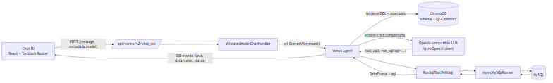
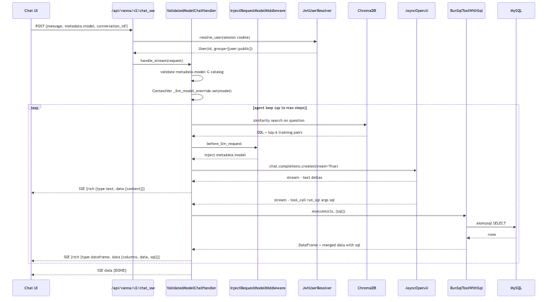

# SocialHub — Text-to-SQL (AI Chat) Design Document

The `/chat` page lets a signed-in user ask questions about the SocialHub database
in natural language and get back a prose answer, an executed SQL statement, and a
rendered data table — all streamed live. This document explains how that pipeline
is built end-to-end.

---

## 1. Goals

1. **Conversational read access** to the MySQL database without the user writing SQL.
2. **Grounded generation** — answers must reflect the actual schema and real rows, not the LLM's prior.
3. **Transparent** — the executed SQL is always shown next to its result so the user can audit it.
4. **Streaming UX** — first tokens visible within a second; the agent's intermediate tool-calls also stream.
5. **Safe-by-construction** — untrusted prompts cannot damage data or exfiltrate secrets.
6. **Non-blocking** — chat traffic must not starve the rest of the FastAPI app.

---

## 2. Architecture at a Glance



*Source: [`assets/text-to-sql-architecture.mmd`](assets/text-to-sql-architecture.mmd)*

Key fact: the system is built around the open-source **[Vanna](https://vanna.ai)** agent
library. Vanna supplies the agent loop, tool registry, LLM abstractions, chat HTTP routes,
and SSE protocol. We supply the **project-specific pieces**: schema knowledge, a non-blocking
SQL runner, a non-blocking LLM client, a JWT user resolver, a tool wrapper that echoes the
executed SQL back to the UI, and a frontend that renders the streamed rich components.

---

## 3. The Data the Agent Sees (Grounding)

The agent has no hard-coded knowledge of our schema. Instead, two kinds of context live in
a persistent **ChromaDB** collection (`socialhub_memory`, stored under `.chroma/`):

### 3.1 Schema DDL
On every startup, `app/core/vanna_config.py` reads the repository's `schema.sql` and upserts
it under the stable id `socialhub-seed-ddl`:

```python
DDL = Path("schema.sql").read_text()
collection.upsert(
    ids=["socialhub-seed-ddl"],
    documents=[DDL],
    metadatas=[{"content": DDL, "is_text_memory": True, ...}],
)
```

Stable ids make startup idempotent — restarts never duplicate the seed rows.

### 3.2 Question ↔ SQL Training Pairs
`TRAINING_PAIRS` in `vanna_config.py` ships 16 curated examples such as:

| Natural-language question                          | Gold SQL                                                                    |
| -------------------------------------------------- | --------------------------------------------------------------------------- |
| "What are the most liked posts?"                   | `SELECT … FROM posts p JOIN users u … ORDER BY p.like_count DESC LIMIT 10;` |
| "Show posts from the last 7 days"                  | `SELECT … WHERE p.created_at >= NOW() - INTERVAL 7 DAY …`                   |
| "How many posts were created each day?"            | `GROUP BY DATE(created_at)`                                                 |
| "Show a user leaderboard: posts + likes received"  | `GROUP BY u.user_id … ORDER BY post_count DESC`                             |
| "Which users write the most comments?"             | `JOIN comments c ON c.user_id = u.user_id GROUP BY u.user_id`               |

Each pair is stored as a `SearchSavedCorrectToolUses` memory with `tool_name="run_sql"`
and `args_json={"sql": …}`. At query time Vanna's retriever performs a similarity search
on the user's question and re-surfaces matching examples as few-shot demonstrations.

### 3.3 User-Contributed Memory
Signed-in users are also given two "write" tools (`SaveQuestionToolArgsTool`,
`SaveTextMemoryTool`) so the agent can learn new mappings mid-conversation.
Anonymous users have read-only access (`access_groups=["public"]`), signed-in users have
`["user"]` — enforced by Vanna's tool registry, **not** by convention.

---

## 4. Request Lifecycle



*Source: [`assets/text-to-sql-sequence.mmd`](assets/text-to-sql-sequence.mmd)*

Each HTTP request is a single SSE stream. The frontend iterates with
`response.body.getReader()` (see `web/src/features/chat/api/stream-sse.ts`) and fans each
"rich component" event into the assistant message's `text`, `dataframes`, `cards`, or
`notifications` arrays.

---

## 5. Component Walk-Through

### 5.1 Agent Initialization — `app/core/vanna.py`

```python
def init_vanna() -> Agent:
    llm = MetadataOpenAILlmService(api_key=..., base_url=...)
    mysql_runner = AsyncMySQLRunner(host=..., database=..., ...)
    _memory = ChromaAgentMemory(
        persist_directory=".chroma",
        collection_name="socialhub_memory",
    )
    vanna_fs = LocalFileSystem(working_directory=".vanna")

    registry = ToolRegistry()
    registry.register_local_tool(RunSqlToolWithSql(sql_runner=mysql_runner,
                                                   file_system=vanna_fs),
                                 access_groups=["user", "public"])
    registry.register_local_tool(VisualizeDataTool(file_system=vanna_fs),
                                 access_groups=["user", "public"])
    registry.register_local_tool(SearchSavedCorrectToolUsesTool(),
                                 access_groups=["user", "public"])
    registry.register_local_tool(SaveQuestionToolArgsTool(),
                                 access_groups=["user", "public"])
    registry.register_local_tool(SaveTextMemoryTool(),
                                 access_groups=["user"])

    _agent = Agent(
        llm_service=llm,
        tool_registry=registry,
        user_resolver=JwtUserResolver(),
        agent_memory=_memory,
        config=AgentConfig(stream_responses=True, temperature=0.3),
        llm_middlewares=[InjectRequestModelMiddleware()],
    )
    return _agent
```

Registered only once during FastAPI's `lifespan`. `mount_vanna_routes(app)` attaches the
`/api/vanna/*` routes (including `POST /chat_sse`) to the existing FastAPI app.

### 5.2 Authentication — `JwtUserResolver`

Vanna delegates identity to a pluggable `UserResolver`. Ours reads the same HttpOnly
`session` cookie the rest of the API uses:

```python
class JwtUserResolver(UserResolver):
    async def resolve_user(self, request_context: RequestContext) -> User:
        token = request_context.get_cookie("session")
        if not token:
            return User(id="anonymous", group_memberships=["public"])
        try:
            payload = jwt.decode(token, settings.jwt_secret, algorithms=["HS256"])
            return User(id=str(payload["user_id"]), group_memberships=["user"])
        except jwt.PyJWTError:
            return User(id="anonymous", group_memberships=["public"])
```

Consequences:

- Chat access uses the **same identity model** as the REST API — no separate auth stack.
- Group membership drives tool visibility: anonymous callers can read but cannot write memories.
- Conversation history in agent memory is partitioned by `user.id`.

### 5.3 Non-Blocking LLM — `MetadataOpenAILlmService`

Vanna's default OpenAI integration uses the synchronous `openai.OpenAI` client. In a FastAPI
app that blocks the event loop for the entire duration of an LLM call. Our replacement:

- Inherits `OpenAILlmService` so we keep its payload-building & tool-validation helpers.
- Builds a parallel `openai.AsyncOpenAI` client with the same credentials.
- Overrides `send_request` and `stream_request` to `await` that async client.
- Collapses the streamed tool-call deltas (`index`, incremental `arguments`) back into a
  single `ToolCall(id, name, arguments)` at the end of the stream.

### 5.4 Per-Request Model Selection

`/api/config` exposes a **server-configured catalog** of allowed chat models
(`VANNA_CHAT_MODELS` env var) — the UI renders it as a dropdown. A user's choice flows like
this:

1. Frontend sends `{ metadata: { model: "gpt-4o-mini" } }` on each SSE request.
2. `ValidatedModelChatHandler.handle_stream`:
   - Compares the value against the catalog (prevents arbitrary model strings / prompt-injection to point at a rogue endpoint).
   - If allowed, stores it in a `ContextVar` scoped to this request only.
3. `InjectRequestModelMiddleware.before_llm_request` reads the `ContextVar` and merges it
   into `LlmRequest.metadata["model"]`.
4. `MetadataOpenAILlmService._build_payload` lets metadata override the default `model`
   right before the API call.

`ContextVar` is the key — it survives `await`s inside the same task and is automatically
isolated across concurrent requests, without needing to thread an argument through the whole
Vanna pipeline.

### 5.5 The `run_sql` Tool — `RunSqlToolWithSql`

The stock `RunSqlTool` emits only `columns + rows`; we wrap it so the executed SQL is also
attached to the dataframe payload the client receives:

```python
class RunSqlToolWithSql(RunSqlTool):
    async def execute(self, context, args) -> ToolResult:
        result = await super().execute(context, args)
        if not result.success or result.ui_component is None:
            return result
        rc = result.ui_component.rich_component
        if not isinstance(rc, DataFrameComponent):
            return result
        merged = {**(rc.data or {}), "sql": args.sql}
        return result.model_copy(update={
            "ui_component": result.ui_component.model_copy(
                update={"rich_component": rc.model_copy(update={"data": merged})}
            )
        })
```

That single extra field is why the chat UI can display the actual SQL next to each result
table and let the user copy it — a key transparency property.

### 5.6 The SQL Runner — `AsyncMySQLRunner`

Vanna expects a `SqlRunner` that returns a `pandas.DataFrame`. Our implementation uses
`aiomysql` so it never blocks the event loop:

```python
class AsyncMySQLRunner(SqlRunner):
    async def run_sql(self, args: RunSqlToolArgs, context: ToolContext) -> pd.DataFrame:
        conn = await aiomysql.connect(host=..., user=..., password=..., db=..., port=...)
        try:
            async with conn.cursor(aiomysql.DictCursor) as cur:
                await cur.execute(args.sql)
                rows = await cur.fetchall()
                columns = [d[0] for d in cur.description] if cur.description else []
                return pd.DataFrame(rows, columns=columns)
        finally:
            conn.close()
```

The runner does **not** reuse the main API's pool — Vanna owns the lifecycle here, and
isolating chat queries keeps long-running analytics SQL from starving the request pool.

### 5.7 Frontend Streaming — `streamSSE` + `useChat`

`streamSSE` is a tiny async generator over `fetch`:

```ts
for (const line of lines) {
  if (!line.startsWith("data: ")) continue;
  const payload = line.slice(6);
  if (payload === "[DONE]") return;
  yield JSON.parse(payload);   // { rich: {type, id, data}, conversation_id? }
}
```

`useChat` then dispatches on `rich.type`:

| `rich.type`         | Rendered as                                                        |
| ------------------- | ------------------------------------------------------------------ |
| `text`              | Incrementally updated prose bubble (streamdown renders markdown).  |
| `dataframe`         | Appended row in `DataTable` with a syntax-highlighted SQL preview. |
| `card` / `status_card` | Inline "tool is running" card.                                  |
| `notification`      | Banner (info / warning / error).                                   |
| `status_bar_update` | Live status line under the assistant's avatar.                     |

Because state is keyed by a client-generated assistant message id (`nanoid()`), multiple
dataframes or cards from the same turn simply accumulate — no server-side state is needed.

---

## 6. Worked Example

**User types:** *"Who are the most liked users in the last 30 days?"*

1. The question is posted to `/api/vanna/v2/chat_sse`.
2. The resolver confirms the JWT and returns `User(id="42", groups=["user"])`.
3. Chroma's similarity search retrieves:
   - The full `schema.sql` DDL.
   - The training pair *"Show a user leaderboard: most posts, with total likes received"*.
   - The training pair *"How many likes happened each day in the last 30 days?"*.
4. The LLM (streamed) first emits an acknowledging sentence, then a `tool_call`:

   ```json
   {
     "name": "run_sql",
     "arguments": {
       "sql": "SELECT u.username, u.name, COUNT(l.like_id) AS likes_last_30d \nFROM users u JOIN posts p ON p.user_id = u.user_id \nJOIN likes l ON l.post_id = p.post_id \nWHERE l.created_at >= NOW() - INTERVAL 30 DAY \nGROUP BY u.user_id, u.username, u.name \nORDER BY likes_last_30d DESC LIMIT 10;"
     }
   }
   ```
5. `RunSqlToolWithSql` runs it through `AsyncMySQLRunner`, attaches the SQL string to the
   payload, and returns a DataFrame.
6. The server emits two SSE events to the browser:
   - `{"rich":{"type":"text", "data":{"content":"Here are the top liked users..."}}}`
   - `{"rich":{"type":"dataframe", "data":{"columns":[...],"data":[...],"sql":"SELECT …"}}}`
7. The frontend appends the rows to a `DataTable` card and displays the SQL in a "Show SQL"
   expander; a copy button copies both SQL and TSV-formatted rows.

---

## 7. Safety Considerations

- **No string-concatenated SQL.** All internal application SQL is parameterized. The agent
  *generates* raw SQL, but it runs against a MySQL user that can be restricted to
  `SELECT`-only at deployment time (recommended in production).
- **Schema-limited prompts.** The DDL seeded into memory is the only ground-truth the LLM
  sees; there is no credential, secret, or environment data in the prompt.
- **Model allow-list.** `ValidatedModelChatHandler` rejects any `metadata.model` not in the
  server catalog, preventing a malicious client from redirecting inference to an unknown
  model/provider.
- **Authenticated writes to memory.** Only `group="user"` can persist `SaveTextMemoryTool`
  entries — so anonymous traffic cannot poison future retrieval.
- **Request-scoped model override.** Using `ContextVar` rather than a module global avoids
  cross-request bleed in a concurrent `uvicorn` worker.
- **JWT decode failures are soft.** A bad or missing cookie demotes the caller to
  `public`; we never 500 on an invalid token.

---

## 8. Files to Read

| Path                                    | What it does                                               |
| --------------------------------------- | ---------------------------------------------------------- |
| `app/core/vanna.py`                     | Agent bootstrap, tool registration, memory seeding, route mounting. |
| `app/core/vanna_config.py`              | Loads `schema.sql` and ships 16 `(question, SQL)` pairs.   |
| `app/core/vanna_chat_model.py`          | `AsyncOpenAI` LLM, per-request model override, model allow-list. |
| `app/core/run_sql_tool.py`              | Wraps `RunSqlTool` so executed SQL reaches the UI.         |
| `app/core/async_mysql_runner.py`        | Non-blocking `aiomysql`-based `SqlRunner`.                 |
| `app/routers/website_config.py`         | `/api/config` — exposes the chat model catalog.            |
| `web/src/features/chat/api/stream-sse.ts` | Client-side SSE reader.                                  |
| `web/src/features/chat/hooks/use-chat.ts` | React state machine for the streaming message.           |
| `web/src/routes/chat.tsx`               | Page composition: message list + prompt input + models.    |

---

## 9. Possible Extensions

1. **Conversation persistence.** Today conversation id is held only in browser memory;
   backing it with a `conversations` table would allow resuming.
2. **Read-only MySQL role.** Deploy the API with a grant like
   `GRANT SELECT ON social_media.* TO 'vanna_ro'@'%'` to make destructive SQL impossible
   even under prompt-injection.
3. **Query budget.** Cap rows returned / execution time per tool call to prevent an LLM
   from emitting `SELECT * FROM posts CROSS JOIN likes`.
4. **Visualization choices.** `VisualizeDataTool` is already registered; exposing chart
   rendering in the UI is a small frontend lift.
5. **Feedback loop.** When a user clicks "👍" on a dataframe, persist
   `(question, sql)` via `SaveQuestionToolArgsTool` so the system learns from real usage.
